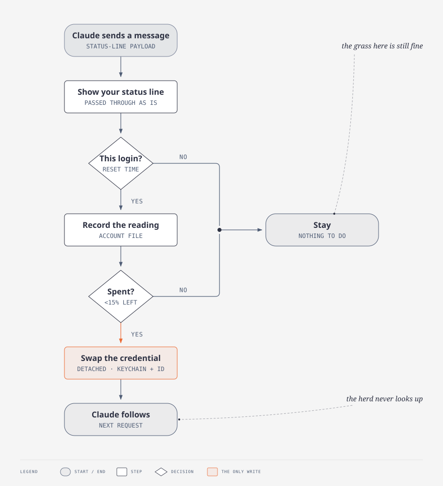
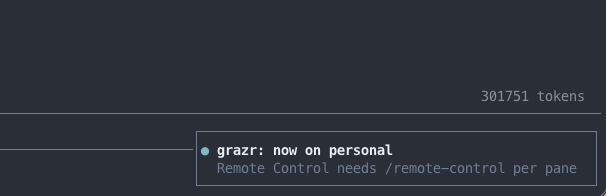
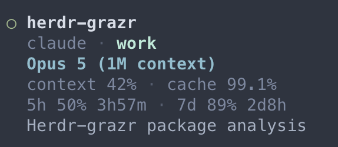

<p align="center">
  <picture>
    <source media="(prefers-color-scheme: dark)" srcset="docs/grazr-logo-dark.svg">
    
  </picture>
</p>
<h1 align="center">grazr</h1>
<p align="center">Rotational grazing for <a href="https://claude.com/claude-code">Claude Code</a>: moves the herd to a fresh account before the pasture runs out.<br>A <a href="https://herdr.dev">Herdr</a> plugin.</p>
<br>

<p align="center">
  <a href="https://github.com/wazum/herdr-grazr/actions/workflows/ci.yml"></a>
  
  <a href="https://www.python.org"></a>
  <a href="https://herdr.dev"></a>
  
  <a href="LICENSE"></a>
</p>

A Claude pane goes dead when the 5-hour or weekly limit hits. Getting it back
means logging in as another account by hand. *grazr* does not wait for the wall.
When a window is nearly spent, it swaps which stored credential the official
`claude` binary reads. It does that between turns, so no pane is ever blocked
or prompted.

**You do nothing.** There is no command to run and no prompt to answer. A pane
mid-task keeps going on the fresh account, and a pane you were not watching
never shows that anything changed. You keep working as if nothing had happened,
because from where you sit, nothing did.

**Requires** two or more Claude subscriptions that are all yours. The badges
above carry the rest.

[How it works](#how-it-works) ·
[Install](#install) ·
[Swap on demand](#swap-on-demand) ·
[After a swap](#after-a-swap) ·
[What it will not do](#what-it-will-not-do) ·
[Policy](#policy)

## How it works



You log in to each account once, with Claude's own `claude auth login`. *grazr*
never sees a password and never mints a token. It copies the credential that a
normal login already produced into a parked copy of its own, then copies it
back when that account's turn comes. The `claude` binary is unmodified, and it
re-reads its credential every 30 seconds. That is what makes the swap
invisible.

*grazr* keeps parked credentials where Claude keeps the live one. On macOS that
is the keychain, and no secret ever touches the disk. On Linux there is no
keychain: Claude's own login is a file only you can read, and a parked
credential is stored the same way, in the state directory. The other state
files hold only names, identities and the last known headroom.

## Install

```sh
herdr plugin install wazum/herdr-grazr
```

Then enrol each account:

```sh
herdr plugin pane open --plugin wazum.grazr --entrypoint enrol
```

Pick `s` for the account you are logged into now. Pick `l` for each extra one.
`l` logs in through a throwaway config directory, so your live session is never
logged out. One keypress, no Return. `q` or `Esc` closes the pane without
changing anything.

Then list them in the order you want them used:

```sh
$EDITOR "$(herdr plugin config-dir wazum.grazr)/config.env"
```

```sh
REMAINING_SESSION=30     # rotate when the 5-hour window has less than this left
REMAINING_WEEKLY=20      # weekly windows get more margin, because losing one costs days
ACCOUNTS="work personal" # preference order, first with headroom wins
ENABLED=1
DRY_RUN=0                # 1 = log the decision, do not swap
LIVE_USAGE_BELOW=45      # start confirming here, above the thresholds
```

Start with `DRY_RUN=1` for a day. Decisions show up in `herdr plugin log`.

### Why `LIVE_USAGE_BELOW` exists

Claude writes what it knows about your limits into `~/.claude.json`, and
*grazr* reads it there. That copy can sit unrefreshed for over an hour, which
is long enough for a window to go from half full to spent without *grazr* ever
seeing a number in between. Waiting for it means rotating late, and rotating
late is the one failure that costs you the session.

So once headroom drops below `LIVE_USAGE_BELOW`, *grazr* asks the same endpoint
Claude asks, using the credential it already keeps, and never more than once
every five minutes however many panes go idle together. Above that mark it does
not reach for the network at all. Set it to `0` to turn the call off and leave
*grazr* with whatever Claude last wrote down.

The two marks work as a pair. `LIVE_USAGE_BELOW` opens a band above the
thresholds where *grazr* starts confirming, and the thresholds are where it
swaps. Keep the band wide, because Claude's reading runs behind the window it
describes and the whole point is to catch that before it crosses the line.
Thirty percent of a five-hour window is around twenty minutes at a heavy pace,
which survives both a lagging reading and the wait for the next check. Fifteen
does not.

The endpoint is undocumented, so *grazr* asks as little as it can. It never
asks when no other account could take over, because the answer cannot change
anything. And it weighs the age Claude stamped on a reading against the pace
the last two imply, so a number that only looks safe because it is half an hour
old still earns a call, while a fresh one above the mark costs nothing. That
estimate decides when to ask, never when to rotate. A swap is always made
against a reading.

Once a reading says a swap is due, the confirming call comes on a shorter
leash than the one that only watches, because five minutes of drift is a lot
of window at a heavy pace. And if the endpoint does not answer, *grazr* falls
back to Claude's cached reading and says so in `herdr plugin log` rather than
going quiet.

### Turn Herdr's toasts on

**Herdr toasts are off by default**, so *grazr*'s notification will not show
until you turn them on. `herdr notification show` also exits 0 when it shows
nothing, so *grazr* reads the JSON to find out. Add this to
`~/.config/herdr/config.toml`:

```toml
[ui.toast]
delivery = "herdr"
delay_seconds = 1

[ui.toast.herdr]
position = "bottom-right"
```

Then run `herdr server reload-config`. Pick `terminal` instead of `herdr` if
you work over SSH, or `system` for macOS Notification Centre.

A plugin toast lasts about three seconds and there is no setting for it, so
*grazr* keeps the text to one short line and plays a sound. Pick `system` or
`terminal` delivery to read it at your own pace, or set
`HERDR_DISABLE_SOUND=1` for silence.

Herdr drops a toast while another one is on screen. For the "nothing left" and
"account restricted" messages, *grazr* notices and says it again next time
instead of assuming you read it. A rotation is announced once, so a dropped
toast still leaves the swap in `herdr plugin log`.

## Swap on demand

Sometimes you do not want to wait for the threshold. The session is at 93% and
a long task is about to start, so you would rather be on a fresh account first.
*grazr* has an action for that. Bind it to a key in
`~/.config/herdr/config.toml`:

```toml
[[keys.command]]
key = "prefix+shift+s"
type = "plugin_action"
command = "wazum.grazr.swap"
description = "grazr: swap account now"
```

Then run `herdr server reload-config`. The key moves you to the first account
in `ACCOUNTS` with headroom, which is the choice the automatic path would make,
and announces it in the usual toast. It does not ask whether the account you
are leaving still has room. You asked for the move, so it moves. `DRY_RUN=1`
applies here too. `ENABLED=0` does not, since that flag only quiets the
automatic path. If every other account is spent, the key swaps nothing and says
so in a toast, with the earliest reset time, and in `herdr plugin log`.

## After a swap

<p align="center">
  
</p>

*grazr* says which account it moved to, in a toast and in `herdr plugin log`. To
see what is enrolled and what each account has left:

```sh
herdr plugin pane open --plugin wazum.grazr --entrypoint status
```

### Remote Control disconnects

Claude's Remote Control belongs to the signed-in account, so it disconnects on
every swap. Restart it with `/remote-control` in each pane you care about.
*grazr* says so in its notification, but it will not type the command for you.
That would mean writing into panes that may be mid-turn, and *grazr* never
touches the screen.

### The account in your sidebar

A toast is gone in three seconds. *grazr* also publishes the active account as
a `$grazr` token on every Claude pane, so the sidebar keeps saying which
account you are on.

<p align="center">
  
</p>

Herdr shows a token only where your own sidebar row asks for it. Add `$grazr`
to a row in `~/.config/herdr/config.toml`, keeping whatever rows you already
have:

```toml
[ui.sidebar.agents]
rows = [
  ["state_icon", "workspace", "tab"],
  [{ token = "agent" }],
  [{ token = "$grazr", fg = "#b5ead7" }],
  [{ token = "terminal_title_stripped" }],
]
```

Each entry in `rows` is one line. Give the tag its own: a row carrying three
tokens truncates before it reaches the third.

Then run `herdr server reload-config`. A pane picks up the tag when Claude
starts in it, and a rotation repaints every pane. Panes already open when you
added the row are still blank, so fill them in once:

```sh
herdr plugin action invoke wazum.grazr.tag
```

A pane you have scrolled up in is skipped until you scroll back down, because
repainting a pane's metadata can jump it to the bottom.

## What it will not do

- Rotate away from an account the server has restricted. Moving off a
  restricted account is how you get around the restriction, and the Usage
  Policy forbids that. *grazr* stops and tells you.
- Act on usage data it cannot trust. If the cached usage belongs to another
  account, or is more than an hour old, *grazr* does nothing.
- Write a credential it cannot write whole. macOS `security` quietly truncates
  an over-long input and destroys the item, so *grazr* measures first and
  refuses.

## Policy

*grazr* rotates between subscriptions that all belong to the person running it.
It never shares credentials, never routes requests through another client, and
never changes the `claude` binary.

Anthropic's public documents do not limit how many accounts one person may
have, and they do not cover switching between two of your own plans. The Claude
Code docs call `CLAUDE_CONFIG_DIR` "Useful for running multiple accounts side
by side", and they list switching accounts as a normal answer to a usage limit.

Two clauses point the other way, and no document settles them. Advertised
limits "assume ordinary, individual usage of Claude Code". The Consumer Terms
forbid reaching the services "through automated or non-human means, whether
through a bot, script, or otherwise". *grazr* is a script on the credential path,
not on the request path. But Anthropic has not said whether chaining personal
plans counts as ordinary use, and it can enforce without notice. Anthropic's
own answer to a limit is usage credits. Read the current terms and decide for
yourself.
